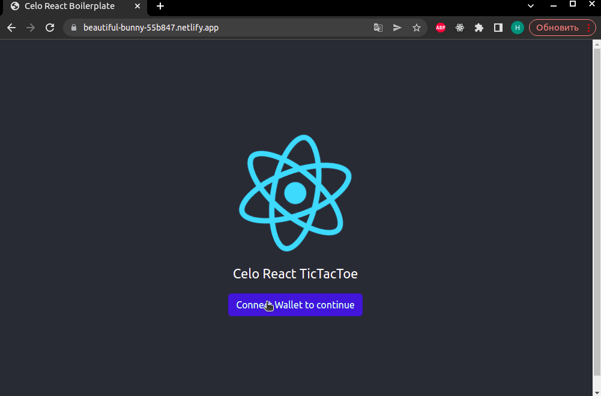
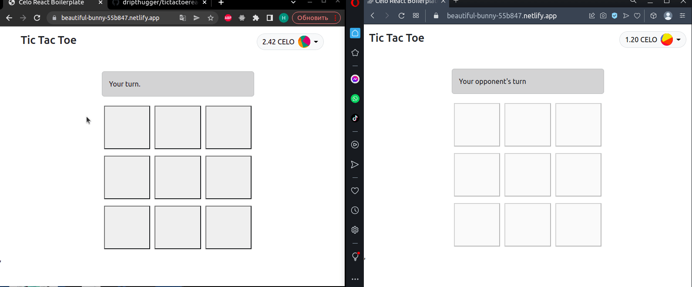
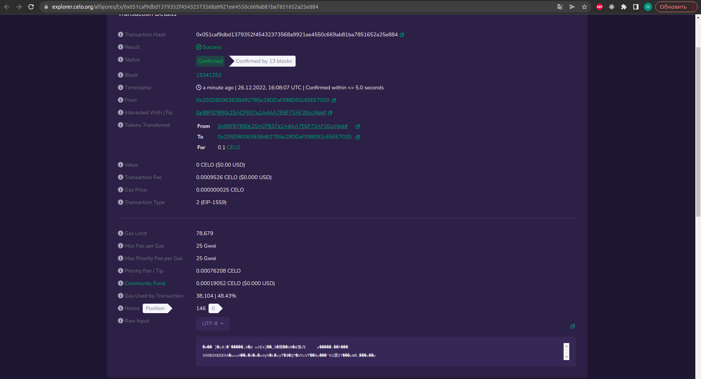
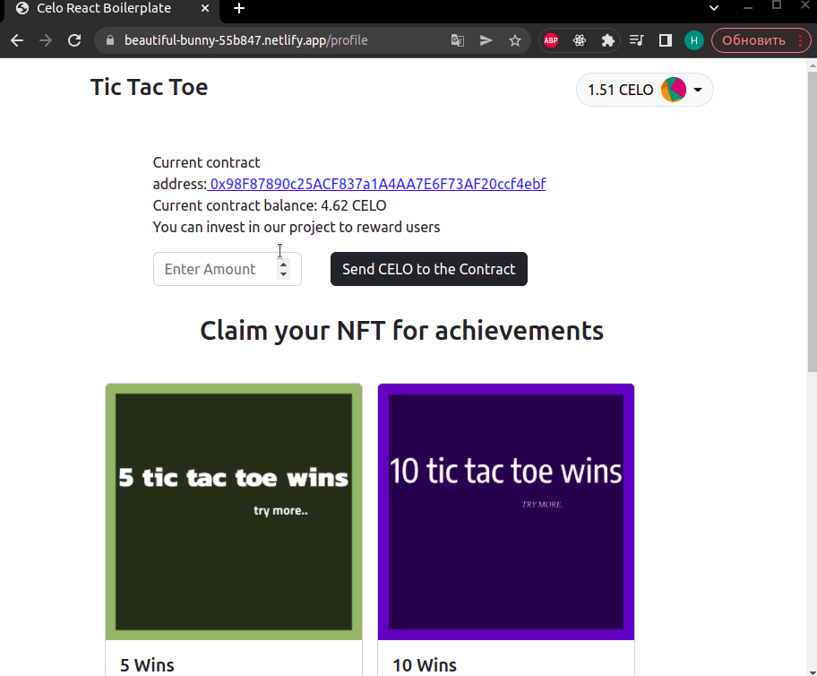
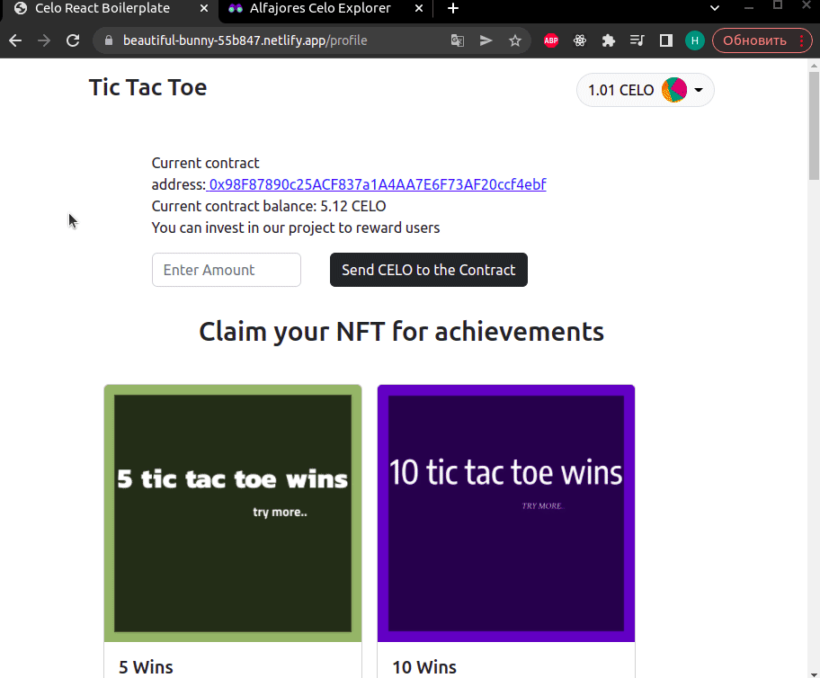

# Celo React Tic Tac Toe
## Description

Disclaimer: this is a practic project for the dacade.org course.

This is a web application for Tic Tac Toe online, that gives an ability for players to battle against each other. For every win, a player gets rewarded with 0.1 CELO. Also, players can deposit their funds to the contract to help the organization.

Every player's win is written as a transaction and can be viewed in CELO explorer.
Methods of the contracts are signed using web3.eth signatures to avoid access to the contract from outsite

Also there are achievements players can complete(win 5 times, win 10 times). For every achievement, player can mint achievement NFT.

## Live Demo

https://beautiful-bunny-55b847.netlify.app

In addition, production server source - https://glitch.com/~fourth-hissing-war

## 1. Tech Stack
This Dapp uses the following tech stack:
- [React](https://reactjs.org/) - A JavaScript library for building user interfaces.
- [use-Contractkit](contractkit
) - A frontend library for interacting with the Celo blockchain.
- [Hardhat](https://hardhat.org/) - A tool for writing and deploying smart contracts.
- [React Bootstrap](https://react-bootstrap.github.io/) - A CSS framework that provides responsive, mobile-first layouts.
- [Axios](https://axios-http.com/) - A promise-based HTTP client for node.js.
- [ExpressJS](https://expressjs.com/) - Node.js web application framework used as server to deal with sockets and save data.
- [WebsocketJS](https://developer.mozilla.org/en-US/docs/Web/API/WebSocket) - protocol that provides a way to exchange data between browser and server via a persistent connection.

## 2. Quick Start

To get this project up running locally, follow these simple steps:

### 2.1 Clone the repository:

```bash
git clone https://github.com/dripthugger/tictactoe-celo-react.git
```

### 2.2 Navigate to the directory:

```bash
cd tictactoe-celo-react
```

### 2.3 Install the dependencies for the client and run the dApp:

```bash
cd client && npm install && npm start
```

### 2.4 Install the dependencies for the server and run:
In another terminal:
```bash
cd server && npm install && node server.js
```


To properly test the dapp you will need to have a Celo wallet with testnet tokens.

## 3. Smart-Contract Deployment

To deployt smart contracts that the dapp will interact with by, check the following steps below:

### 3.1 Compile the smart contract
In the client directory:
```bash
npx hardhat compile
```

### 3.2 Run tests on smart contract
In the client directory:
```bash
npx hardhat test
```

### 3.3 Update env file

- Rename file "/client/.env.example" to "/client/.env"
- Paste your mnemonic key from wallet to constant MNEMONIC
- Paste your private key from wallet to constant REACT_APP_PRIVATE_KEY (used to sign transactions)

```js
MNEMONIC = "...";
REACT_APP_PRIVATE_KEY="";
```

In this case, we are using a mnemonic and private key from an account created on Metamask. You can copy it from your Metamask account settings. An account created on the Celo extension wallet will not work.

### 3.4 Deploy the smart contract to the Celo testnet Aljafores

In the client directory
```bash
npx hardhat run --network alfajores scripts/deploy.js
```

This command will update the src/contract files with the deployed smart contract ABI and contract address.

## 4. Site review

```
To authorize we need to connect a wallet(in this case it is metamask). After successful authorization we see a TicTacToe board, user's wallet address and balance
```



```
When two players are on the site, the game will begin
Players see each other's step in real time, because of Websocket used in the project.
After a win, a player gets rewarded with 0.1 CELO, he just needs to pay fee and wait a couple seconds
```



```
We can watch reward(win) transaction on CELO explorer
```
* [link to the transaction](https://explorer.celo.org/alfajores/tx/0x051caf9dbd1379352f45432373568a9921ee4550c669ab81ba7851652a25e884)



## Profile Page
```
Player sees a contract's address and balance, also player can deposit CELO funds to the contract to help the project reward users
```


```
Players have an achievements for 5 wins and 10 wins.
After every achievement, a player can mint an NFT.
```


# Usage
1. Install the wallet, for example [Metamask](https://chrome.google.com/webstore/detail/metamask/nkbihfbeogaeaoehlefnkodbefgpgknn) from the google chrome store.
2. Create a wallet.
3. Go to [https://celo.org/developers/faucet](https://celo.org/developers/faucet) and get tokens for the alfajores testnet.
4. Switch to the alfajores testnet in the Metamask.